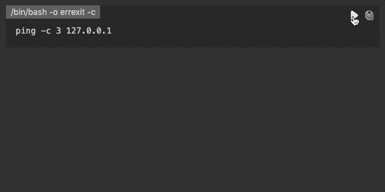

# OpsScriptMD

 

半自動化のためのドキュメンテーションツール

## モチベーション

顧客へ安定したサービスを提供するためには、本番環境の運用作業で発生するミスをできるだけ減らすことが重要です。全ての運用作業が完全に自動化され、十分に検証されていれば理想的ですが、そもそも自動化されていなかったり、自動化された内容に不備があるかもしれません。

運用作業を**半自動化**することで手作業につきまとうヒューマンエラーのリスクを減らせます。もしくは、自動化された作業の全てが終わってから事故に気付くのではなく、各作業がうまくいったか人が確認しながら着実に作業を進めることができます。

## このツールが実現すること

このツールは Markdown で書かれた作業手順書内のスクリプトを直接実行できるようにすることで、運用作業の半自動化を実現します。

- 運用作業手順を事前にレビューできます
- 結果を確認しながらステップバイステップで運用作業を実行できます
- 作業履歴を確認できます

## インストール

1. [Visual Studio Code](https://code.visualstudio.com/) をインストール
2. Visual Studio Code のマーケットプレイスから [OpsScriptMD](https://marketplace.visualstudio.com/items?itemName=negokaz.opsscriptmd) をインストール

## 使い方

### 運用作業手順書を書く

手順書のサンプルが [samples](samples) にあります。

### OpsView を開く

いくつかの方法があります。

#### Markdown ファイルのコンテキストメニューから開く

Markdown を左クリックし、「OpsScriptMD: Open OpsView」を選択します。

#### Markdown ドキュメントのタイトルバーから開く

Markdown ドキュメントを編集中にタブバーのアイコンをクリックします。

#### コマンドパレットから開く

Markdown ドキュメントを開いた状態で `F1` キーを押下し、「OpsScriptMD: Open OpsView」を選択します。

### OpsView から運用作業を実施

スクリプトの領域にある再生ボタンをクリックするとスクリプトが実行されます。

コピーボタンをクリックするとスクリプトがクリップボードにコピーされます。

OpsView からうまくスクリプトを実行できないときに、他のツールでスクリプトを実行したい場合などに便利です。

## 変更履歴

[CHANGELOG.md](./CHANGELOG.md) を確認してください。

## ライセンス

Copyright (c) 2019 Kazuki Negoro

OpsScriptMD は [MIT ライセンス](./LICENSE) の下にリリースされています。
